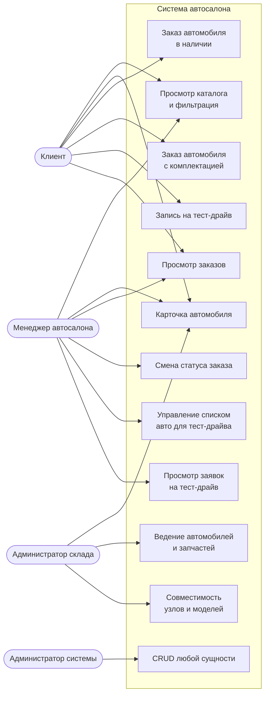
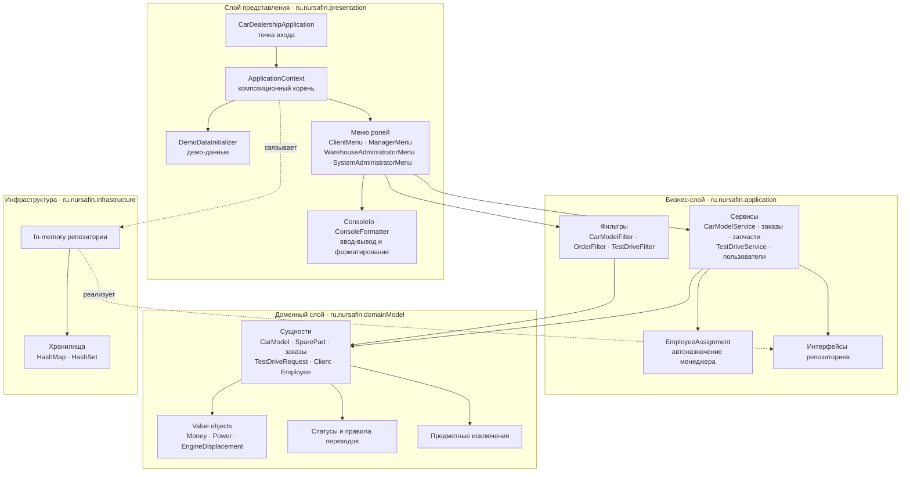
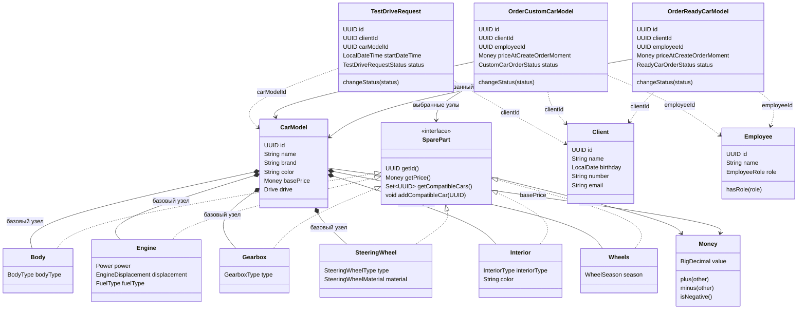
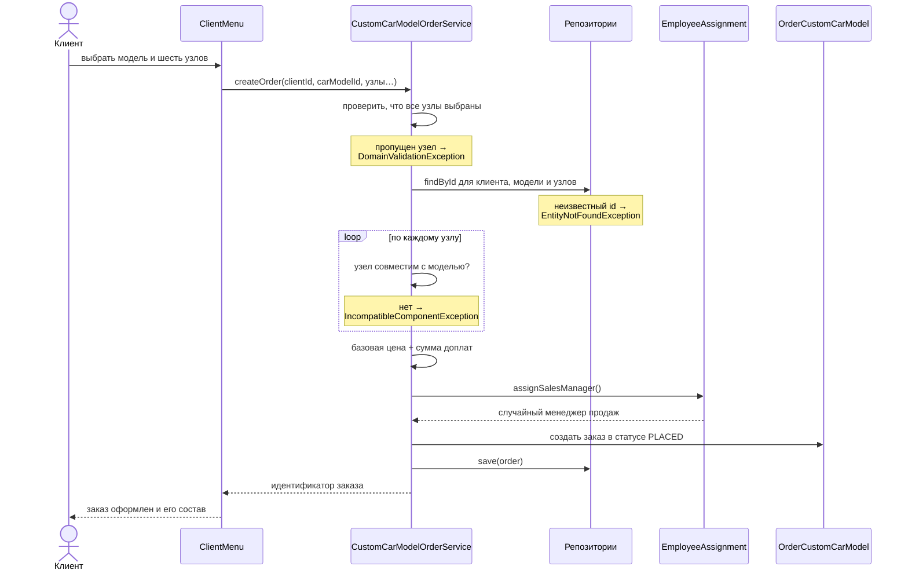
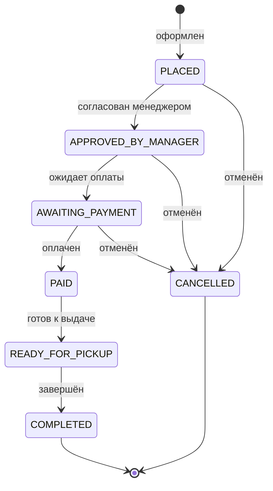
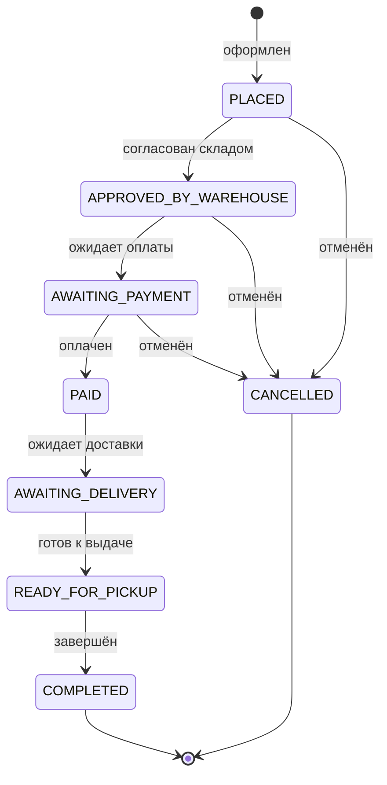
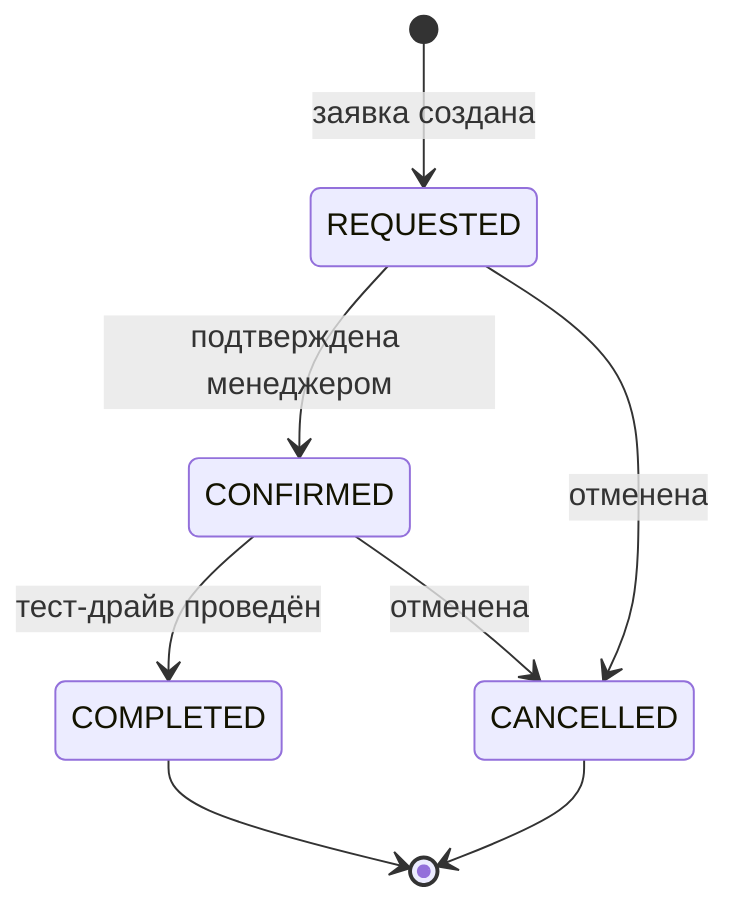
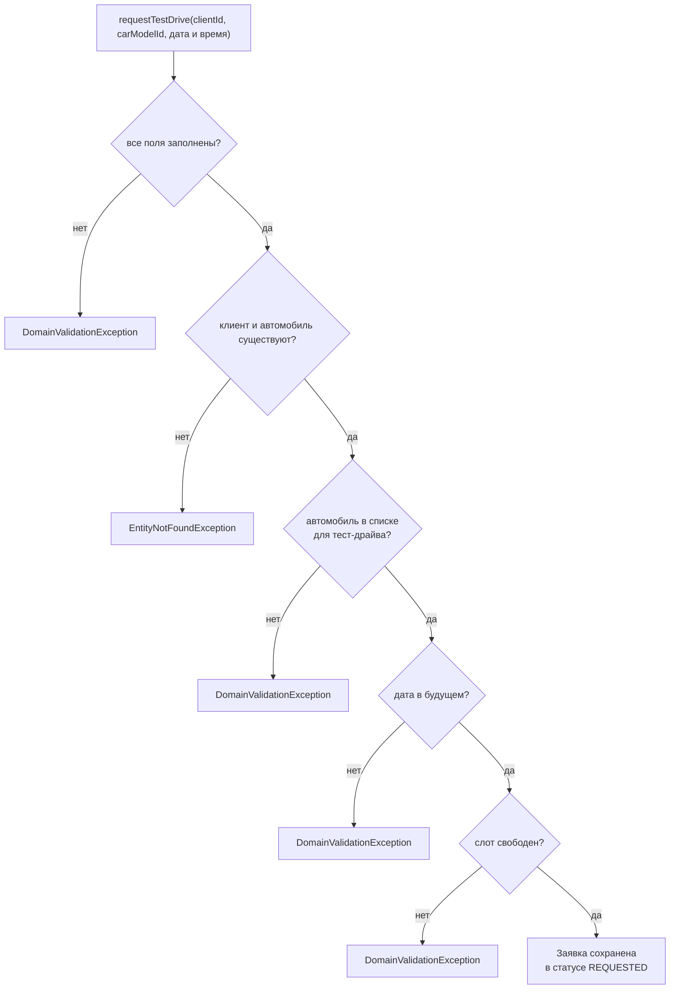
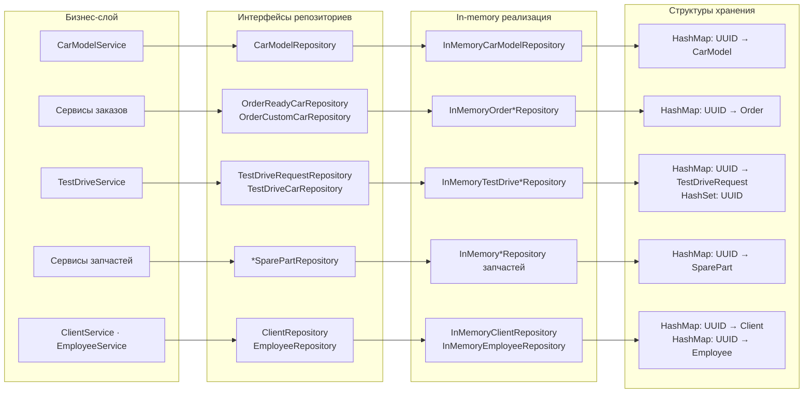

# Автосалон — информационная система

Back-end информационной системы мультибрендового автосалона: каталог автомобилей с фильтрами,
конфигуратор комплектаций с проверкой совместимости узлов, два типа заказов со своими жизненными
циклами, запись на тест-драйв и разграничение сценариев по ролям пользователей.

`Java 23` · `Gradle 8.12` · `JUnit 5` · `Mockito` · `JaCoCo` · `Docker`

---

## Содержание

- [О проекте](#о-проекте)
- [Пользователи и сценарии](#пользователи-и-сценарии)
- [Архитектура](#архитектура)
- [Структура проекта](#структура-проекта)
- [Доменная модель](#доменная-модель)
- [Конфигуратор автомобиля](#конфигуратор-автомобиля)
- [Жизненный цикл заказов](#жизненный-цикл-заказов)
- [Тест-драйв](#тест-драйв)
- [Хранилище данных](#хранилище-данных)
- [Фильтрация каталога](#фильтрация-каталога)
- [Обработка ошибок](#обработка-ошибок)
- [Тестирование](#тестирование)
- [Запуск](#запуск)
- [Демонстрационные данные](#демонстрационные-данные)

---

## О проекте

Система моделирует работу частного мультибрендового автосалона. В ней есть каталог моделей
автомобилей, склад запчастей (узлов), клиенты и сотрудники с ролями, заказы и заявки на тест-драйв.

Ключевая часть системы — **конфигуратор**: клиент собирает автомобиль из вариантов узлов,
система проверяет совместимость каждого варианта с конкретной моделью и считает итоговую стоимость
как «базовая цена модели + сумма доплат за выбранные узлы».

Основные свойства реализации:

| Свойство | Решение |
|---|---|
| Архитектура | Трёхслойная: представление → бизнес-логика → домен, инфраструктура подключается через интерфейсы |
| Хранилище | In-memory репозитории поверх `HashMap` / `HashSet`, без БД |
| Внедрение зависимостей | Ручная сборка графа объектов в композиционном корне `ApplicationContext` |
| Деньги | `BigDecimal` со шкалой 2; поддерживаются отрицательные доплаты (например, −30 000 ₽ за механическую КПП) |
| Валидация | Предметные исключения: `DomainValidationException`, `IncompatibleComponentException`, `EntityNotFoundException` |
| Переходы статусов | Таблицы допустимых переходов внутри enum-ов, недопустимый переход отклоняется доменом |
| Интерфейс | Консольное меню, разное для каждой роли |
| Сборка | Gradle, запуск через `application`-плагин и Docker-образ |
| Тесты | JUnit 5 + Mockito, покрытие контролируется JaCoCo (порог 70%) |

---

## Пользователи и сценарии



Меню консоли соответствует ролям один в один:

| Роль | Класс меню | Что доступно |
|---|---|---|
| Клиент | `ClientMenu` | Каталог с фильтрами, карточка авто, оба типа заказов, запись на тест-драйв, свои заказы и заявки |
| Менеджер автосалона | `ManagerMenu` | Каталог, заказы обоих типов с фильтрами, смена статусов, список авто для тест-драйва, заявки |
| Администратор склада | `WarehouseAdministratorMenu` | Добавление и изменение автомобилей и запчастей, цены, совместимость узлов с моделями |
| Администратор системы | `SystemAdministratorMenu` | Создание, изменение и удаление клиентов, сотрудников, автомобилей, заказов и заявок |

---

## Архитектура

Зависимости направлены строго внутрь: представление знает о бизнес-слое, бизнес-слой — о домене
и об **интерфейсах** репозиториев, инфраструктура реализует эти интерфейсы. Домен не зависит ни от чего.



**Почему так:** бизнес-слой обращается к хранилищу только через интерфейсы
(`CarModelRepository`, `OrderReadyCarRepository`, `TestDriveRequestRepository` и др.), поэтому
in-memory реализацию можно заменить на БД, не трогая сервисы, а в unit-тестах репозитории
подменяются моками.

---

## Структура проекта

```
src/main/java/ru/nursafin/
├── domainModel/                  # доменный слой: сущности и правила
│   ├── entities/
│   │   ├── car/                  # CarModel + CarModelBuilder
│   │   ├── order/                # OrderReadyCarModel, OrderCustomCarModel
│   │   ├── sparePart/            # SparePart и 6 типов узлов с билдерами
│   │   ├── testDrive/            # TestDriveRequest + статусы заявки
│   │   └── valueObjects/         # Money, Power, EngineDisplacement
│   ├── statuses/                 # ReadyCarOrderStatus, CustomCarOrderStatus
│   ├── users/                    # Client, Employee, EmployeeRole
│   └── exceptions/               # предметные исключения
│
├── application/                  # бизнес-слой
│   ├── services/                 # сценарии использования
│   ├── repositories/             # интерфейсы доступа к данным
│   └── filters/                  # объекты-фильтры для выборок
│
├── infrastructure/               # реализация хранилища
│   ├── repositories/             # in-memory репозитории
│   └── db/dataBase/…             # структуры хранения
│
└── presentation/                 # слой представления
    ├── ApplicationContext        # сборка зависимостей
    ├── DemoDataInitializer       # наполнение демо-данными
    ├── CarDealershipApplication  # main
    └── console/                  # меню, ввод-вывод, форматирование
```

---

## Доменная модель



### Сущности

| Сущность | Назначение |
|---|---|
| `CarModel` | Модель автомобиля: бренд, модель, цвет, базовая стоимость, привод и шесть базовых узлов |
| `SparePart` | Общий контракт узла: цена-доплата и множество совместимых моделей |
| `OrderReadyCarModel` | Заказ автомобиля в наличии: клиент, менеджер, автомобиль, цена на момент заказа, статус |
| `OrderCustomCarModel` | Заказ с комплектацией: то же плюс шесть выбранных узлов |
| `TestDriveRequest` | Заявка на тест-драйв: клиент, автомобиль, дата и время, статус |
| `Client` | Клиент салона |
| `Employee` | Сотрудник с ролью `SALES_MANAGER`, `WAREHOUSE_ADMINISTRATOR` или `SYSTEM_ADMINISTRATOR` |
| `Money` | Денежная величина на `BigDecimal`, допускает отрицательные доплаты |

---

## Конфигуратор автомобиля

Комплектация — это набор из шести узлов. У каждой модели есть базовый вариант каждого узла с доплатой
0 ₽, а альтернативные варианты имеют собственную доплату, которая может быть и отрицательной.
Совместимость задаётся бизнес-правилами салона: каждый вариант узла хранит список моделей,
на которые его разрешено ставить.

**Итоговая стоимость = базовая стоимость модели + сумма доплат выбранных узлов.**



### Пример: BMW 320i

Базовая комплектация — доплата 0 ₽ за каждый узел, базовая цена модели 3 000 000 ₽.

| Узел | Вариант | Доплата | Совместимость |
|---|---|---|---|
| Колёса | 17'' Standard | 0 ₽ | 320i, 330i, A4 Avant |
| Колёса | 18'' Aero | +45 000 ₽ | 320i, 330i |
| Колёса | 19'' M-Sport | +95 000 ₽ | 320i, 330i |
| Трансмиссия | Automatic 8AT | 0 ₽ | 320i, 330i, A4 Avant |
| Трансмиссия | Manual 6MT | −30 000 ₽ | 320i, 330i |
| Руль | Sport leather (Standard) | 0 ₽ | 320i, 330i, A4 Avant |
| Руль | M-Sport heated | +25 000 ₽ | 320i, 330i |
| Интерьер | Fabric Graphite | 0 ₽ | 320i, 330i, A4 Avant |
| Интерьер | Leather Dakota | +110 000 ₽ | 320i, 330i |
| Интерьер | Sport Performance | +160 000 ₽ | только 330i |

**Корректная конфигурация:** 19'' M-Sport + Automatic 8AT + M-Sport heated + Leather Dakota

```
3 000 000 + 95 000 + 25 000 + 110 000 = 3 230 000 ₽
```

**Отрицательная доплата:** базовая комплектация с Manual 6MT

```
3 000 000 − 30 000 = 2 970 000 ₽
```

**Ошибка совместимости:** интерьер Sport Performance для 320i

```
IncompatibleComponentException: Spare part <id> is not compatible with this car model: <id>
```

**Пропущенный узел:** не выбран интерьер

```
DomainValidationException: missing required component "Interior"
```

---

## Жизненный цикл заказов

Статусы вынесены в enum-ы с таблицей допустимых переходов, а сама смена статуса выполняется
методом `changeStatus` доменной сущности — недопустимый переход отклоняется независимо от того,
кто его инициировал.

### Заказ автомобиля в наличии



### Заказ автомобиля с комплектацией



Отмена возможна только до оплаты; `COMPLETED` и `CANCELLED` — финальные состояния.
Менеджер на заказ назначается автоматически: `EmployeeAssignment` выбирает случайного сотрудника
с ролью `SALES_MANAGER`, и если таких сотрудников нет — заказ не создаётся.

---

## Тест-драйв

Менеджер ведёт список автомобилей, доступных для тест-драйва; клиент записывается только на
автомобиль из этого списка.



Правила при создании заявки:



Текущее время сервис берёт из внедряемого `Clock`, поэтому проверка «дата в будущем» детерминированно
воспроизводится в тестах.

---

## Хранилище данных

Данные живут в памяти процесса: репозитории работают поверх простых коллекций, изолируя бизнес-слой
от способа хранения.



Все репозитории следуют единому контракту `save` / `findById` / `findAll` / `deleteById`;
`findById` для отсутствующего идентификатора бросает `EntityNotFoundException`.

---

## Фильтрация каталога

`SuitableCars` собирает выборку из репозитория и применяет фильтры через Stream API.
Пустое поле фильтра означает «критерий не применяется».

| Критерий | Поле фильтра |
|---|---|
| Цена автомобиля | `minBasePrice`, `maxBasePrice`, `minTotalPrice`, `maxTotalPrice` |
| Бренд | `brand` |
| Модель | `model` — доступна только при заданном бренде |
| Цвет автомобиля | `color` |
| Кузов | `bodyType` |
| Тип топлива | `fuelType` |
| Мощность двигателя | `minPower`, `maxPower` |
| Объём двигателя | `minEngineDisplacement`, `maxEngineDisplacement` |
| Тип КПП | `gearboxType` |
| Привод | `drive` |
| Цвет салона | `interiorColor` |

Попытка отфильтровать по модели без выбранного бренда отклоняется:
`DomainValidationException: Model filter is available only when brand is chosen`.

---

## Обработка ошибок

| Исключение | Когда возникает | Примеры сообщений |
|---|---|---|
| `DomainValidationException` | Нарушены правила домена или не заполнены обязательные данные | `missing required component "Interior"`, `missing required field "client"`, `Test drive can be booked only for the future` |
| `IncompatibleComponentException` | Выбранный узел не совместим с моделью автомобиля | `Spare part <id> is not compatible with this car model: <id>` |
| `EntityNotFoundException` | Сущность с указанным идентификатором отсутствует | `CarModel with id <id> not found` |

Консоль перехватывает исключения на уровне меню и печатает `Error: <сообщение>`, не прерывая сессию.

---

## Тестирование

- **158 тестов** в 17 классах: JUnit 5 + Mockito.
- **Покрытие строк — около 91%**, порог проверяется автоматически.
- `jacocoTestCoverageVerification` подключён к задаче `check`: сборка падает, если покрытие строк
  опустится ниже **70%**.

Что покрыто:

| Уровень | Проверяется |
|---|---|
| Юнит-тесты сервисов | Логика на моках репозиториев: расчёт стоимости, совместимость, назначение менеджера, фильтры, валидация |
| Доменные тесты | Арифметика и округление `Money`, таблицы переходов статусов, билдеры узлов |
| Сценарные тесты | Сквозные сценарии на реальных in-memory репозиториях: заказ, конфигурация, тест-драйв, CRUD |
| Тесты консоли | Меню прогоняются со сценарным вводом и проверкой вывода, включая ошибочные данные |

```bash
./gradlew test                      # прогон тестов
./gradlew jacocoTestReport          # отчёт: build/reports/jacoco/test/html/index.html
./gradlew build                     # сборка + тесты + проверка порога покрытия
```

---

## Запуск

### Локально

```bash
./gradlew installDist
./build/install/car-dealership/bin/car-dealership
```

### В Docker

```bash
docker build -f docker/Dockerfile -t car-dealership .
docker run -it --rm car-dealership
```

Образ собирается в два этапа: сборка дистрибутива на JDK-образе и запуск на JRE-образе.

После старта приложение наполняется демонстрационными данными и открывает меню выбора роли:

```
=== Car dealership ===
1) Sign in as client
2) Sign in as sales manager
3) Sign in as warehouse administrator
4) Sign in as system administrator
0) back
```

---

## Демонстрационные данные

При старте создаются каталог, склад узлов, сотрудники и клиенты — систему можно проверять сразу.

**Автомобили**

| Бренд и модель | Цвет | Базовая цена | Привод | Кузов | Двигатель |
|---|---|---|---|---|---|
| BMW 320i | white | 3 000 000 ₽ | задний | седан | 2.0 Turbo, бензин, 184 л.с. |
| BMW 330i | black | 3 600 000 ₽ | полный | седан | 2.0 Turbo, бензин, 184 л.с. |
| Audi A4 Avant | blue | 3 200 000 ₽ | передний | универсал | 2.0 D, дизель, 190 л.с. |

**Сотрудники**

| Имя | Роль |
|---|---|
| Ivan Sokolov | `SALES_MANAGER` |
| Petr Volkov | `SALES_MANAGER` |
| Anna Orlova | `WAREHOUSE_ADMINISTRATOR` |
| Maria Titova | `SYSTEM_ADMINISTRATOR` |

**Клиенты:** Alexey Ivanov, Olga Smirnova.
**Доступны для тест-драйва:** BMW 320i и BMW 330i.
